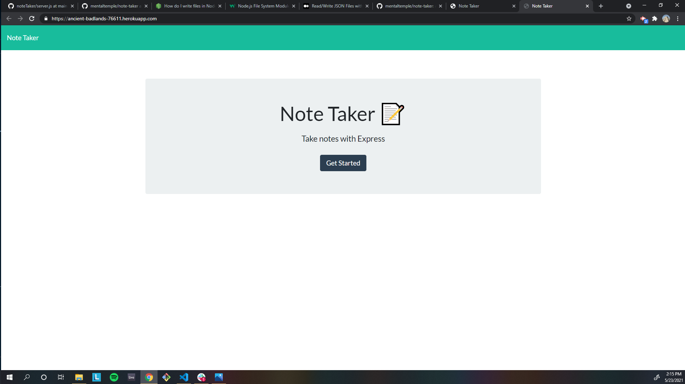
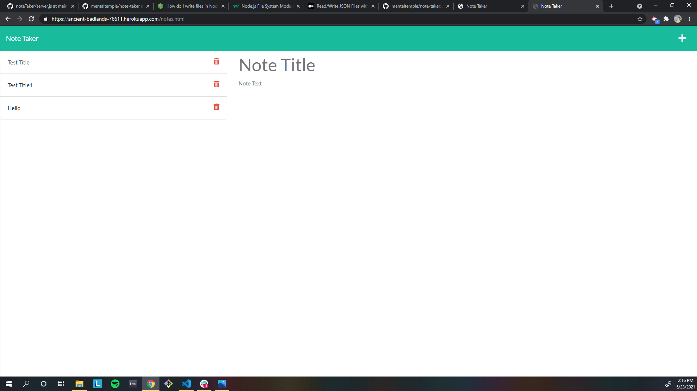

[](https://opensource.org/licenses/MIT)

# Note Taker


## Description

As a developer, I wanted to build an application that saves notes in a persistent database to be retrieved and viewed later.

## Table of Contents

- [Installation](#installation)
- [Usage](#usage)
- [Credits](#credits)
- [Tests](#tests)
- [Questions](#questions)
- [License](#license)

## Installation

Navigate to: https://ancient-badlands-76611.herokuapp.com/notes.html

## Usage

Click on the "Get Started" button. This will navigate to the Note Taker page. Add a title and text for your new note, click save. Click on the note to view previously stored notes!





## Credits

Special thanks to:

-AskBCS Learning Assistant

## Tests

No testing available at this time.

## Questions

For additional questions, you can check out my GitHub profile:

https://github.com/mentaltemple

or email me at mentaltemple@yahoo.com.

## License

MIT License

Copyright (c) [2021] [Joshua Randy Abeyta]

Permission is hereby granted, free of charge, to any person obtaining a copy
of this software and associated documentation files (the "Software"), to deal
in the Software without restriction, including without limitation the rights
to use, copy, modify, merge, publish, distribute, sublicense, and/or sell
copies of the Software, and to permit persons to whom the Software is
furnished to do so, subject to the following conditions:

The above copyright notice and this permission notice shall be included in all
copies or substantial portions of the Software.

THE SOFTWARE IS PROVIDED "AS IS", WITHOUT WARRANTY OF ANY KIND, EXPRESS OR
IMPLIED, INCLUDING BUT NOT LIMITED TO THE WARRANTIES OF MERCHANTABILITY,
FITNESS FOR A PARTICULAR PURPOSE AND NONINFRINGEMENT. IN NO EVENT SHALL THE
AUTHORS OR COPYRIGHT HOLDERS BE LIABLE FOR ANY CLAIM, DAMAGES OR OTHER
LIABILITY, WHETHER IN AN ACTION OF CONTRACT, TORT OR OTHERWISE, ARISING FROM,
OUT OF OR IN CONNECTION WITH THE SOFTWARE OR THE USE OR OTHER DEALINGS IN THE
SOFTWARE.

```

```
